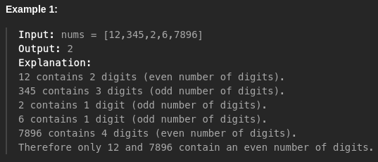

- In linear search we traverse through each array elements one by one.
- We start searching from the first element till we find the desired element.
- Suppose the desired element is present at the end of the array or does not present inside the array in the both cases we have to traverse the whole array. If array had **n** elements then the time complexity will be  **O(n)**.
- Now the element we are looking for is actaully the first element of the array in that case the time complexity will be **O(1)** because it does not matter how many elements that array has we will always get the desired element at the first step.

#### Example 1 : Search for an element inside the array if it exists then return its index value otherwise return -1 :
```java
class Main {
    public static void main(String[] args){
        int[] arr = {34,23,65,233,79,56,6};
        int idx = linearSearch(arr,56);
        System.out.println("idx: "+idx);    // idx: 5
    }

    static int linearSearch(int arr[], int target){
        for(int i=0; i<arr.length; i++){
            if(arr[i]==target){
                return i;
            }
        }

        return -1;
    }
}
```

#### Example 2 : An array of integer is given, return how many array elements have even number of digits. 

```java
class Main {
    public static void main(String[] args){
        int[] arr = {12, 345, 2, 6, 7896};
        int res = linearSearch(arr);
        System.out.println("res: "+res);    // res: 2
    }

    static int linearSearch(int arr[]){
        int count = 0;
        for(int i=0; i<arr.length; i++){
            int num = (int)Math.log10(arr[i])+1;
            if(num%2 == 0){
                count ++;
            }
        }

        return count;
    }
}
```