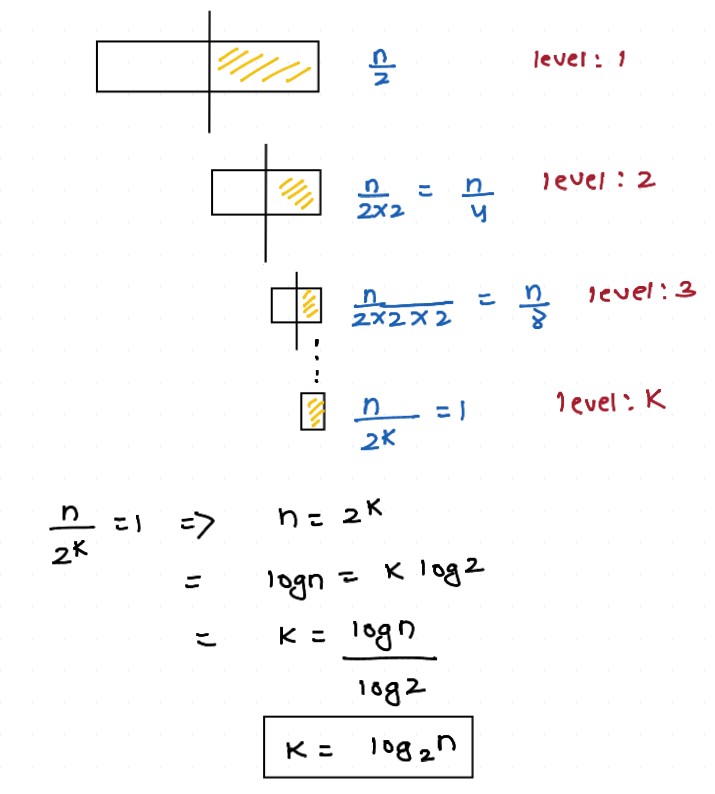

- Sort array before using the binary search.
- Best case time complexity : **O(1)**.
- Worst case time complexity: **O(log n)**



```java
class Dsa {
    public static void main(String[] args){
        int[] arr = {2,6,9,22,39,45,69};
        int idx = binarySearch(arr,2); 
        System.out.println("idx: "+idx);    // idx: 0
    }

    static int binarySearch(int[] arr, int target){
        int low = 0;
        int high = arr.length-1;

        while(low<=high){
            int mid = (low + high)/2;
            if(arr[mid] == target){
                return mid;
            }else if(arr[mid]<target){
                low = mid+1;
            }else {
                high = mid-1;
            }
        }

        return -1;
    }
}
```
- above code can be used only when array is sorted in ASC order. below code is order neutral code we can pass ASC or DESC array it will work in both the cases.

```java
class Dsa {
    public static void main(String[] args){
        int[] arr = {69, 45, 39, 22, 9, 6, 2};
        int idx = binarySearch(arr,2);
        System.out.println("idx: "+idx);
    }

    static int binarySearch(int[] arr, int target){
        int low = 0;
        int high = arr.length-1;

        while(low<=high){
            int mid = (low + high)/2;

            if(arr[mid] == target){
                return mid;
            }

            // when array is soreted in ASC order
            if(arr[0]<arr[arr.length-1]){
                if(arr[mid]<target){
                    low = mid+1;
                }else{
                    high = mid-1;
                }
            }else {
                // when array is sorted in DESC order
                if(arr[mid]>target){
                    low = mid+1;
                }else{
                    high = mid-1;
                }
            }
        }

        return -1;
    }
}
```

#### Example 1 : Find the smallest element in an array which is greater or equal to the target element. (ceiling of a number) :
```java
class Dsa {
    public static void main(String[] args){
        int[] arr = {1,3,5,8,10,15};
        int celVal = celingNumber(arr, 7);
        System.out.println("celVal: "+celVal);  // celVal: 3
    }

    static int celingNumber(int[] arr, int target){
        int low = 0;
        int high = arr.length-1;
        int idx = -1;

        while(low<=high){
            int mid = (low+high)/2;

            if(arr[mid]==target){
                return mid;
            }else if(target<arr[mid]){
                high = mid-1;
                idx = mid;
            }else {
                low = mid+1;
            }
        }

        return idx;
    }
}
```

#### Example 2: Find the greatest element in the array which is less than or equal to the target element (floor value of a number) :
```java
class Dsa {
    public static void main(String[] args){
        int[] arr = {1,3,5,8,10,15};
        int celVal = celingNumber(arr, 18);
        System.out.println("celVal: "+celVal);
    }

    static int celingNumber(int[] arr, int target){
        int low = 0;
        int high = arr.length-1;
        int idx = -1;

        while(low<=high){
            int mid = (low+high)/2;

            if(arr[mid]==target){
                return mid;
            }else if(target<arr[mid]){
                high = mid-1;
            }else {
                low = mid+1;
                idx = mid;
            }
        }

        return idx;
    }
}
```